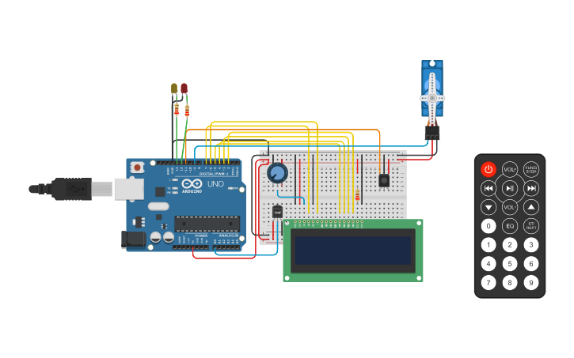

# SEGUNDO PARCIAL SPD UTN 2023


*ALUMNO: Luis Enrique Atoche Castro*

*DIVISION: 1ro J*

## PROYECTO:  
SISTEMA INCENDIOS
## CONSIGNA:
*El objetivo de este proyecto es diseñar un sistema de incendio utilizando Arduino que pueda
detectar cambios de temperatura y activar un servo motor en caso de detectar un incendio.
Además, se mostrará la temperatura actual y la estación del año en un display LCD.*



## DESCRIPCION:
*Este sistema sirve par detectar la temperatura y actuar de consecuencia. En el lcd se muestra la temperatura y la estacion del año, cuando esta temperatura sobrepasa el limite impuesto en 60 grados(señal de que está aconteciendo un incendio) activa el servo y hace alternar el encendido de la s luces led.
La temperatura la manejamos con el control remotoIR*

## ENLACE TINKERCAD:
[enlace al proyecto tinkercad](https://www.tinkercad.com/things/6wrMFRK7ExI)

## CODIGO:
```
//Luis Atoche div J
//2do Parcial SPD Sistema Incendios

//Llamamos las librerias para los elementos que usaremos
#include <LiquidCrystal.h> // Para el LCD
#include <IRremote.h> // Para el Control IR
#include <Servo.h>

// Definimos los pines de cada componente     
#define Tecla_ONOF 0xFF00BF00    
#define Tecla_SUBIR 0xF50ABF00 
#define Tecla_BAJAR 0xF708BF00
#define SENSOR_TEMPERATURA A0
#define LED_1 13
#define LED_2 12 
#define CONTROL_IR 11
#define SERVOMOTOR 9

#define limiteTemperatura 60 //Limite de temperatura para que se active la alarma

LiquidCrystal lcd(7, 6, 5, 4, 3, 2); 

IRrecv irRecibidor(CONTROL_IR); // Indicamos que pin recibirá los datos
decode_results irDato; // Guarda los datos recibidos

Servo servoMotor; 

int temperatura; // Guarda la temperatura leida por el sensor
bool encendido = false; // Indica si el sistema esta encendido o apagado
String estacion; // Guarda la estacion del año

void setup()
{
  pinMode(LED_1, OUTPUT);
  pinMode(LED_2, OUTPUT);

  int temperaturaLeida = analogRead(SENSOR_TEMPERATURA); // Recibe un valor de 0 a 1023
  // Mapea el ese valor a un rango de -40 a 125, que son los limites del sensor de temperatura
  temperatura = map(temperaturaLeida, 20, 350, -40, 125); 

  lcd.begin(16, 2); // Inicializa el LCD con 16 columnas y 2 filas
  servoMotor.attach(SERVOMOTOR); // Inicializa el ServoMotor
  irRecibidor.begin(CONTROL_IR, DISABLE_LED_FEEDBACK); // Inicializa el Control IR
}

void loop()
{
  ControlRemotoIR(); // Controla el sistema con el control remoto  
  EstacionAnio(temperatura); // Indica la estacion del año segun la temperatura

  if (encendido) {
    AlarmaIncendio(temperatura);
    ImprimirTemperatura(temperatura);
    digitalWrite(LED_1, HIGH);
  } else {
    digitalWrite(LED_1, LOW);
    lcd.clear(); // Limpiamos el LCD
  }
}

void ControlRemotoIR()
{
  if (irRecibidor.decode()) {
    switch (irRecibidor.decodedIRData.decodedRawData) {
      case Tecla_ONOF: // Boton de encendido
        encendido = !encendido;
        break;

      case Tecla_SUBIR: //Boton de subir
        temperatura += 5;
        break;

      case Tecla_BAJAR: //Boton de Bajar
        temperatura -= 5;
        break;

      default:
        break;
    }
    irRecibidor.resume(); // Recibe el siguiente dato
  }
  delay(100); // Evitar rebotes
}

void EstacionAnio(int temp)
{
  if (temp >= 25 && temp <= limiteTemperatura){
    estacion = "Verano";
  } else if (temp >= 15 and temp < 25){
    estacion = "Primavera";
  } else if (temp >= 10 and temp < 15){
    estacion = "Otonio";
  } else if (temp >= -5 and temp < 10){
    estacion = "Invierno";
  }
  else {
    estacion = "";
  }
}
// Imprime la temperatura en el LCD junto a la estacion del año
void ImprimirTemperatura(int temp)
{
  lcd.clear();
  lcd.setCursor(0, 0);
  lcd.print("Temp: ");
  lcd.print(temp);
  lcd.print("C");
  lcd.setCursor(0, 1);
  lcd.print(estacion);
  delay(500);
}

// Prende un led y apaga el otro
void PrendeApagaLed(int led_1, int led_2)
{
  digitalWrite(led_1, HIGH);
  digitalWrite(led_2, LOW);
}

// Enciende el servo motor y prende un led
void EncenderServo(int tiempo)
{
  servoMotor.write(90); // Gira el servo motor 90 grados 
  PrendeApagaLed(LED_2, LED_1);
  delay(tiempo);
  servoMotor.write(0); // Gira el servo motor a su posicion inicial
  PrendeApagaLed(LED_1, LED_2);
  delay(tiempo);
}

// Activa el servo y lanza un aviso en caso de sobrepasar la temperatura limite
void AlarmaIncendio(int temp)
{
  if (temp >= limiteTemperatura) {
    lcd.clear();
    lcd.setCursor(0, 0);
    lcd.print("¡¡ALERTA!!");
    lcd.setCursor(0, 1);
    lcd.print("¡¡INCENDIO!!");
    EncenderServo(500);
  }
}
```
## DIAGRAMA ESQUEMATICO:
